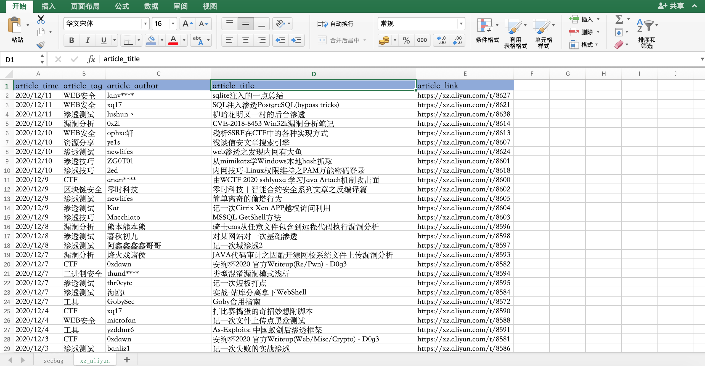
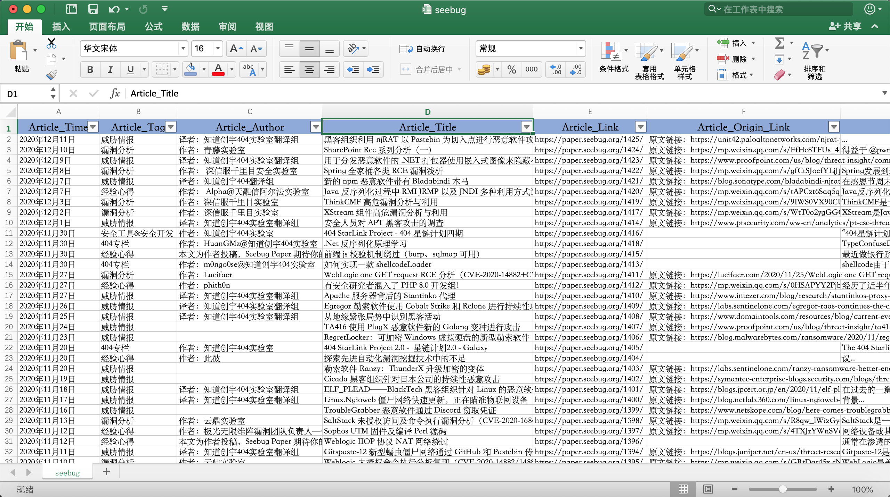

# Security_Article
scrapy website Article and link ...



0x01 新建项目
0x02 明确目标
0x03 制作爬虫
0x04 存储内容

e.g.

`pip3 install lxml,scrapy`

```
文章标题 Article_Title
//*[@id="wrapper"]/main/div/article/header/h5/a/text()

//*[@id="wrapper"]/main/div/article/header/h5/a

文件链接 Article_Link
//*[@id="wrapper"]/main/div/article/header/h5/a/@href

文章时间 Article_Time
//*[@id="wrapper"]/main/div/article/header/section/span/time[1]

文章标签 Article_Tag
//*[@id="wrapper"]/main/div/article/header/section/a

文章简介 Article_Introduction
//*[@id="wrapper"]/main/div/article/section/text()

下一页
//*[@id="wrapper"]/main/div/nav/a[@class="older-posts"]/@href[2]
```

`scrapy crawl SeebugSpider -o seebug.csv`

```
{
	'Article_Author': '译者：知道创宇404实验室翻译组',
	'Article_Link': 'https://paper.seebug.org/1230/',
	'Article_Origin_Link': '原文链接：Cycldek: Bridging the (air) gap ',
	'Article_Summary': '在调查关于Cycldek组织2018年后有关攻击活动时，发现对该组织的...',
	'Article_Tag': '威胁情报',
	'Article_Time': '2020年06月04日',
	'Article_Title': '卡巴斯基报告：针对 Cycldek 黑客组织知识鸿沟的相关信息'
}
```


### 安全文章离线

### Selenium保存网页为mhtml方法

https://www.cnblogs.com/superhin/p/12600358.html

```
from selenium import webdriver

driver = webdriver.Chrome()
driver.get('https://www.qq.com/')

# 1. 执行 Chome 开发工具命令，得到mhtml内容
res = driver.execute_cdp_cmd('Page.captureSnapshot', {})

# 2. 写入文件
with open('qq.mhtml', 'w') as f:
    f.write(res['data'])

driver.quit()
```

## CobaltStrike

### xz.aliyun

| 2020/11/25 | rcoil      | 【知识回顾】Cobalt Strike 4.0 认证及修补过程                 | https://xz.aliyun.com/t/8557 |
| ---------- |  | ------------------------------------------------------------ | ---------------------------- |
| 2020/7/17  | uknow      | 利用ReflectiveDLL来武装你的Cobalt Strike                     | https://xz.aliyun.com/t/7997 |
| 2020/7/17  | treebacker | Metasploit &  CobaltStrike 的shellcode分析                   | https://xz.aliyun.com/t/7996 |
| 2020/4/3   | 利华       | cobaltstrike dns beacon知多少                                | https://xz.aliyun.com/t/7488 |
| 2020/3/10  | castiel    | Cobalt Strike折腾踩坑填坑记录                                | https://xz.aliyun.com/t/7375 |
| 2019/11/12 | Fazx       | Cobaltstrike Server持久化 & Cobaltstrike与Metasploit相互派生shell | https://xz.aliyun.com/t/6722 |
| 2019/10/21 | rcoil      | Cobalt Strike 的 ExternalC2                                  | https://xz.aliyun.com/t/6565 |
| 2019/9/7   | CoolCat    | 细说Cobalt Strike进程注入                                    | https://xz.aliyun.com/t/6205 |
| 2019/9/5   | CoolCat    | CobaltStrike插件开发官方指南 Part4                           | https://xz.aliyun.com/t/6189 |
| 2019/9/4   | CoolCat    | CobaltStrike插件开发官方指南 Part3                           | https://xz.aliyun.com/t/6188 |
| 2019/8/10  | CoolCat    | CobaltStrike插件开发官方指南 Part2                           | https://xz.aliyun.com/t/5892 |
| 2019/8/8   | CoolCat    | CobaltStrike插件开发官方指南 Part1                           | https://xz.aliyun.com/t/5887 |
| 2019/8/7   | CoolCat    | 初探CobaltStrike权限维持及其自动化                           | https://xz.aliyun.com/t/5881 |
| 2019/2/24  | arr0w1     | 渗透利器Cobalt Strike - 第2篇 APT级的全面免杀与企业纵深防御体系的对抗 | https://xz.aliyun.com/t/4191 |
| 2018/9/24  | SoftNight  | 深入研究cobalt strike malleable C2配置文件                   | https://xz.aliyun.com/t/2796 |
| 2018/4/2   | mss****    | 深入探索Cobalt Strike的ExternalC2框架                        | https://xz.aliyun.com/t/2239 |
| 2018/3/18  | mss****    | Cobalt Strike——利用混淆处理绕过Windows Defender              | https://xz.aliyun.com/t/2173 |
| 2018/3/16  | lz1y       | 【软件安全】Patch Cobalt Strike3.8 去除后门并修补功能        | https://xz.aliyun.com/t/2170 |
| 2017/4/14  | backlion   | Cobalt Strike搭建和使用以及bybass杀软                        | https://xz.aliyun.com/t/199  |


### Seebug


| 2020年11月26日 | 译者：知道创宇404实验室翻译组 | Egregor 勒索软件使用 Cobalt Strike 和  Rclone 进行持续性攻击 | https://paper.seebug.org/1409/ |
| -------------- | ----------------------------- | ------------------------------------------------------------ | ------------------------------ |
| 2020年9月28日  | 作者：Keyi                    | Cobalt Strike 绕过流量审计                                   | https://paper.seebug.org/1349/ |
| 2020年6月22日  | 译者：知道创宇404实验室翻译组 | 多阶段 APT 攻击使用 C2 功能降低 Cobalt Strike                | https://paper.seebug.org/1250/ |
| 2020年4月30日  | 作者：启明星辰ADLab           | 渗透利器 Cobalt Strike 在野利用情况专题分析                  | https://paper.seebug.org/1190/ |
| 2020年3月12日  | 作者： Snowming               | Cobalt Strike 4.0 手册——献给渗透测试人员的先进威胁战术       | https://paper.seebug.org/1143/ |


### 酒仙桥六号部队

| 2020年12月10日 | CS4.1真的有后门吗？          | http://mp.weixin.qq.com/s?__biz=MzAwMzYxNzc1OA==&mid=2247488764&idx=1&sn=f22aa97f29bc1859abc99927cae8b8d4 |
| -------------- | ---------------------------- | ------------------------------------------------------------ |
| 2020年12月9日  | CobaltStrike二次开发环境初探 | http://mp.weixin.qq.com/s?__biz=MzAwMzYxNzc1OA==&mid=2247488706&idx=1&sn=83474fa317248dee4aef37444c50d154 |
| 2020年8月3日 | 从DNSBeacon到域控 | http://mp.weixin.qq.com/s?__biz=MzAwMzYxNzc1OA==&mid=2247485914&idx=1&sn=95a424874d8bbc656bb5a067198e4227 |


